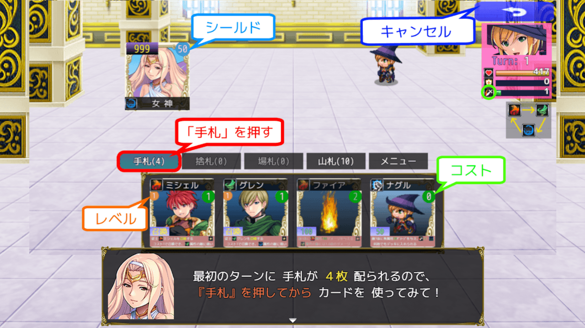

# カードゲームMZサンプル3R
### RPGツクールMZ専用のサンプル・プロジェクト

カードゲームを作りたいけど、どうやって作っていいか分からない方、  
自分の描いたイラストをゲームにしてみたい方などへ 
  
今作は [無印３](https://github.com/nolimits-tukool/CardGameMZSample3) を **「HD画面ノンフィールド型カードゲーム」** に改造したものです  
プラグイン・コモンイベント数が増えているため **「やや上級者向け」** のサンプルプロジェクトになります  
（内容が難しいと感じる方は先に [無印３](https://github.com/nolimits-tukool/CardGameMZSample3) から始めて下さい）

PLiCy「カード使いのケイシー3R」にて、ブラウザ版の [テストプレイができます](https://plicy.net/GamePlay/228669)

### 付属プラグイン（下の「download」ファイルに全て含まれます）
（サンプル起動には TextPicture.js も必要となります）  

 [NLM_CardGameMZ.js](https://github.com/nolimits-tukool/NLM_CardGameMZ) （MZ用カードゲーム・プラグイン）  
 [NLM_CardLayoutMZ.js](https://github.com/nolimits-tukool/NLM_CardLayoutMZ) （MZ用カードレイアウト・プラグイン）  
 [NLM_ItemToSummon.js](https://github.com/nolimits-tukool/NLM_ItemToSummon) （召喚アイテム・プラグイン）  
 [NLM_AnotherBattleStatusMZ.js](https://github.com/nolimits-tukool/NLM_AnotherBattleStatusMZ) （戦闘ステータス追加プラグイン)  
 [NLM_CardEasyInput.js](https://github.com/nolimits-tukool/NLM_CardEasyInput) （カード簡易入力プラグイン）  
 [NLM_SimpleHDLayoutMZ.js](https://github.com/nolimits-tukool/NLM_SimpleHDLayoutMZ) （シンプルなHDレイアウト・プラグイン）  
 [NLM_CommandHeightMZ.js](https://github.com/nolimits-tukool/NLM_CommandHeightMZ) （MZ用コマンド行間設定プラグイン）  
 [NLM_ButtonWidthMZ.js](https://github.com/nolimits-tukool/NLM_ButtonWidthMZ) （MZ用ボタン幅拡大プラグイン）  
 [NLM_CharacterSizeMZ.js](https://github.com/nolimits-tukool/NLM_CharacterSizeMZ) （キャラクターサイズ一括拡大プラグイン）  
 [NLM_PictureFolderMZ.js](https://github.com/nolimits-tukool/NLM_PictureFolderMZ) （ピクチャのフォルダ指定プラグイン）  
 [NLM_UsefulPluginMZ.js](https://github.com/nolimits-tukool/NLM_UsefulPluginMZ) （MZ用お役立ちプラグイン） 

---

#  [download](https://github.com/nolimits-tukool/CardGameMZSample3R/raw/refs/heads/main/CardMZSample3R.zip)

### 「カードゲームMZサンプル3R」（全プラグイン入り）を [download](https://github.com/nolimits-tukool/CardGameMZSample3R/raw/refs/heads/main/CardMZSample3R.zip)  
　　RPGツクールMZ専用プロジェクトです  
　　download解凍後は「readme.txt」に利用方法が書いてあります

### 現在のバージョン： v3R.0.0 (2026/05/15)
  
  
# [リポジトリ一覧へ](https://github.com/nolimits-tukool?tab=repositories)

